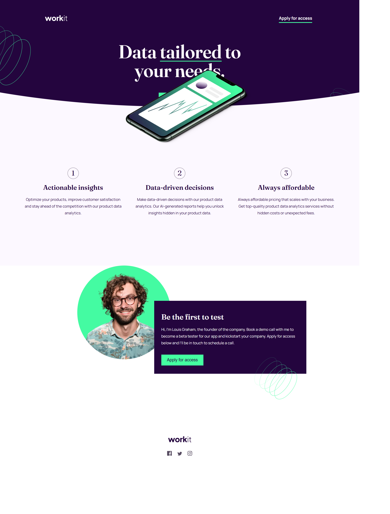
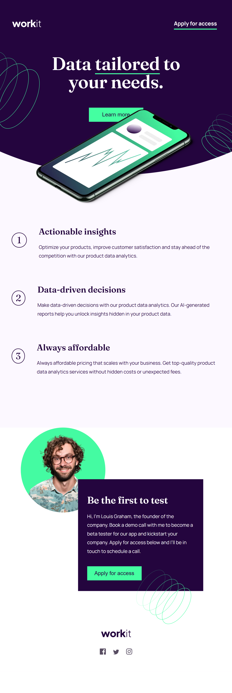
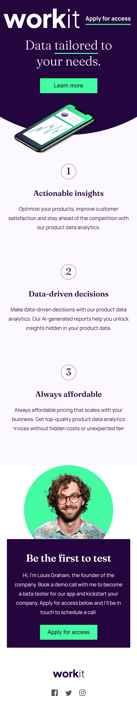

# workit-landing-page

This is the solution for the **Workit Landing Page** challenge provided by [Frontend Mentor](https://www.frontendmentor.io/). The landing page is fully responsive and showcases a modern design with interactive features for mobile, tablet, and desktop devices.

## Table of Contents

- [Overview](#overview)
  - [Screenshots](#screenshots)
  - [Features](#features)
- [Technologies Used](#technologies-used)
- [Getting Started](#getting-started)
- [Project Structure](#project-structure)
- [Acknowledgments](#acknowledgments)

---

## Overview

The **Workit Landing Page** is a responsive layout designed to provide a seamless experience across different devices. It uses modern HTML and CSS techniques and emphasizes accessibility, simplicity, and user interactivity.

### Screenshots

#### Desktop



#### Tablet



#### Mobile



### Features

- **Responsive Design:** Adapts seamlessly to mobile, tablet, and desktop screens.
- **Interactive Buttons:** Smooth hover and transition effects for buttons and links.
- **Clean Typography:** Uses a combination of "Fraunces" and "Manrope" fonts for modern aesthetics.
- **Structured Layout:** Intuitive and easy-to-navigate sections.
- **Social Media Integration:** Links to Facebook, Twitter, and Instagram.

---

## Technologies Used

- **HTML5:** Semantic and accessible markup.
- **CSS3:** Responsive design with media queries and custom properties.
- **Web Fonts:** Integration of "Fraunces" and "Manrope" fonts.

---

### Prerequisites

- A modern web browser.
- A code editor like [VS Code](https://code.visualstudio.com/).

### Installation

1. Clone the repository:
   ```bash
   git clone https://github.com/your-username/workit-landing-page.git
   ```
